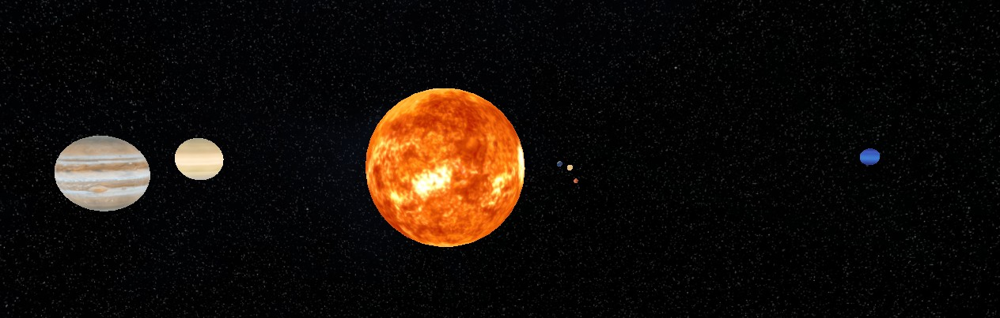



  

# 🪐 Solar-System

Solar System scene made from scratch using Modern OpenGL 3.3

## 📦 Features

- Space Skybox
- Mesh Loader
- Replaceable textures per mesh
- 9 Planets
- Rotation and Orbits

## 🛠️ Built With

- **Language**: C++
- **Build System**: [CMake](https://cmake.org)
- **Third Party**: [ImGui](https://github.com/ocornut/imgui), [GLFW](https://github.com/glfw/glfw), [ASSIMP](https://github.com/assimp/assimp)
- **Platform**: Windows
- **Package System**: [VCPKG](https://github.com/microsoft/vcpkg)

## 🚀 Getting Started

- Clone the repository along with it's submodules
- Go to `vendor/VCPKG` and run **bootstrap-vcpkg.bat**
- Run **install_deps.bat** in the root directory
- Generate project files or open the folder with Visual Studio.
